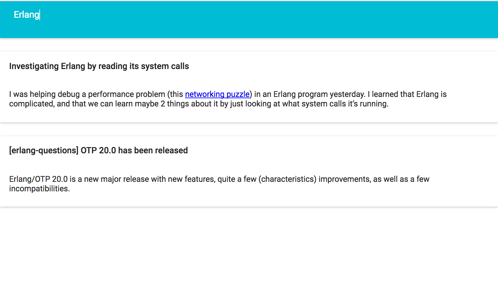

# Current job offers

https://www.elium.com/jobs

# Elium Frontend Challenge

The challenge is to create a web application that displays a feed of stories. The application should be developed in React or React-Native and use GraphQL to load the data to display.

You are free to use any GraphQL framework ([Apollo](http://dev.apollodata.com/react/), [Relay Modern](https://facebook.github.io/relay/docs/relay-modern.html)) or simply use `fetch`.

The GraphQL endpoint is available at https://qwmk4njvp.lp.gql.zone/graphql.

The backend implementation is available at https://launchpad.graphql.com/qwmk4njvp, but it's not required that you fork or modify it.

Styling: we recommend you use [Styled Components](https://www.styled-components.com). The layout and design can be very simple.

<figure>
  
  <figcaption>Example screenshot of the application</figcaption>
</figure>

## Requirements

- List all the retrieved stories
- Filter the stories using a text filter
- Apply styling to the list of components

## Project structure:

We recommend that you use [Create React App](https://github.com/facebookincubator/create-react-app), either locally or within [CodeSandbox](https://codesandbox.io/). Note that it's probably difficult to setup these for relay-modern, Apollo or `fetch` might be easier to use for a small project like this. Babel/Webpack configuration is not the point of this exercice.

Please publish your solution to the challenge on github.com or codesandbox.io and email t.geimer@whatever-company.com with a link.
